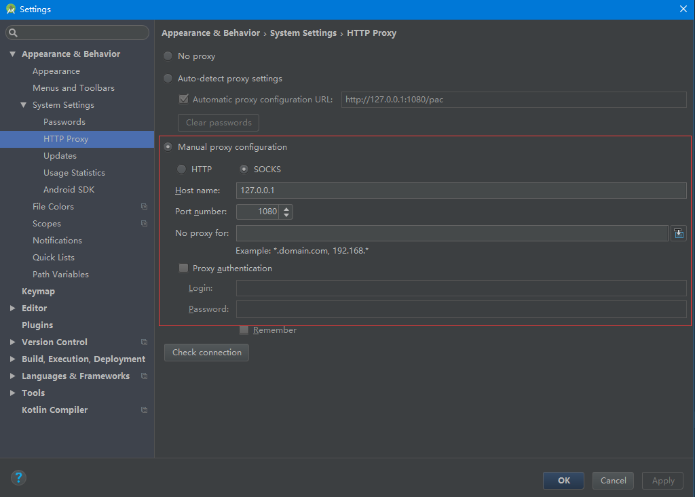
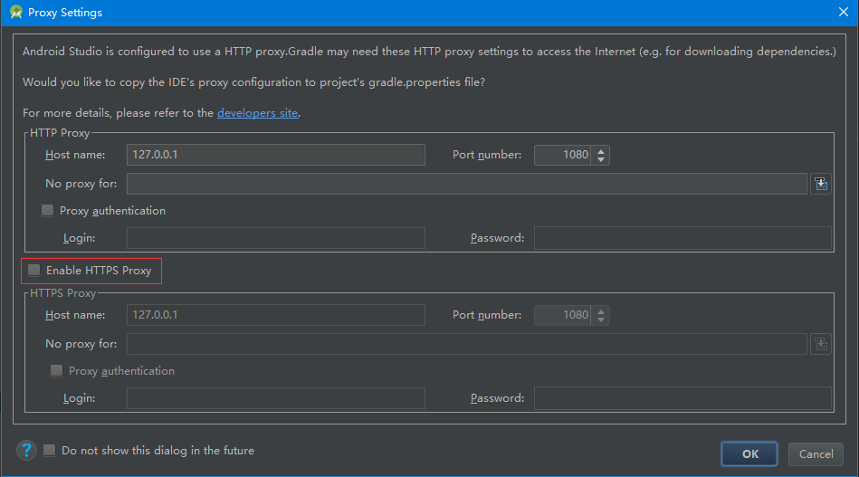

# AndroidStudio 使用SS代理

###### 一、在本机运行Shadowsocks，确保能够科学上网
###### 二、在AndroidStudio中作如下设置



确认后Rebuild,弹出如下对话框

*==请确保勾选Https（因为在下载gradle等时都是使用的https）==*



接着在项目的gradle.properties中会自动添加如下

```
systemProp.https.proxyPort=1080
systemProp.http.proxyHost=127.0.0.1
systemProp.https.proxyHost=127.0.0.1
systemProp.http.proxyPort=1080
```
重新编译，就可以访问google()等仓库了